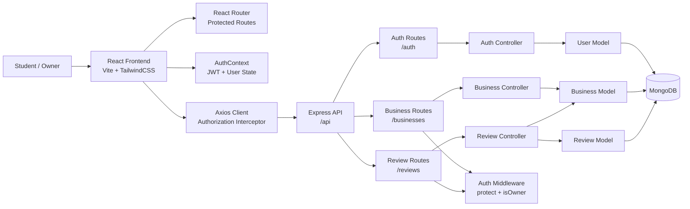
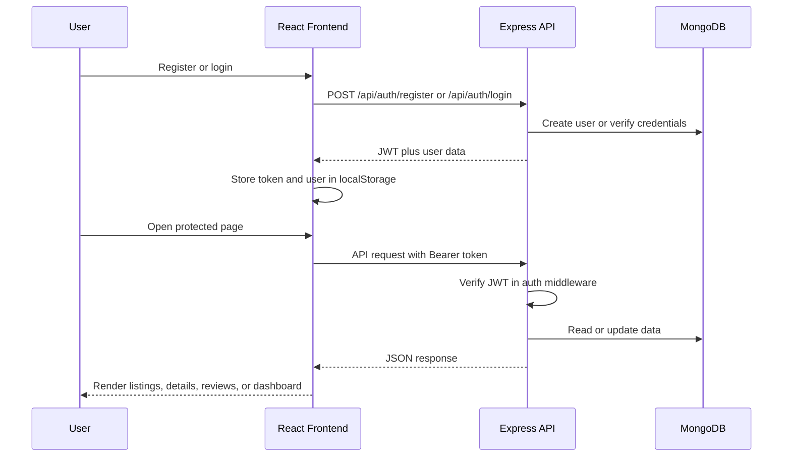

# Campus Guide - Local Spot Reviews

Campus Guide is a full-stack MERN web application for discovering and reviewing useful local spots around a college campus. Students can browse businesses, filter by category, view open/closed status, and add reviews. Business owners can register, create their own business profile, edit details, and monitor review analytics from an interactive dashboard.

The project is built entirely in JavaScript with a React frontend and an Express/MongoDB backend following MVC architecture.

## Features

- Student and owner authentication with JWT.
- Password hashing with bcrypt.
- Public landing page with a modern, vibrant UI.
- Protected pages for listings, top-rated spots, business details, and owner dashboard.
- Business listings grouped by category: Food, Stationery, and PG Accommodation.
- Open/closed shop status based on opening and closing time.
- Star ratings and review submission.
- One review per user per business.
- Automatic recalculation of business average rating after every new review.
- Owner dashboard with business profile creation, owner-only editing, review filters, rating breakdown chart, business status, and review metrics.
- Seeder script for sample businesses.

 Tech Stack

**Frontend**

- React
- Vite
- React Router
- Axios
- TailwindCSS

**Backend**

- Node.js
- Express.js
- MongoDB
- Mongoose
- JWT
- bcryptjs
- cors
- dotenv

## Project Structure

```text
campus_guide/
|-- backend/
|   |-- config/
|   |   `-- db.js
|   |-- controllers/
|   |   |-- authController.js
|   |   |-- businessController.js
|   |   `-- reviewController.js
|   |-- middleware/
|   |   `-- authMiddleware.js
|   |-- models/
|   |   |-- Business.js
|   |   |-- Review.js
|   |   `-- User.js
|   |-- routes/
|   |   |-- authRoutes.js
|   |   |-- businessRoutes.js
|   |   `-- reviewRoutes.js
|   |-- .env.example
|   |-- package.json
|   |-- seeder.js
|   `-- server.js
|-- frontend/
|   |-- public/
|   |-- src/
|   |   |-- api/
|   |   |   `-- axios.js
|   |   |-- components/
|   |   |-- context/
|   |   |-- pages/
|   |   |-- utils/
|   |   |-- App.jsx
|   |   |-- index.css
|   |   `-- main.jsx
|   |-- index.html
|   |-- package.json
|   `-- tailwind.config.js
`-- README.md
```

## System Architecture



## Data Flow



## Database Models

### User

```js
{
  name: String,
  email: String,
  password: String,
  role: 'student' | 'owner',
  createdAt: Date
}
```

### Business

```js
{
  name: String,
  category: 'Food' | 'Stationery' | 'PG Accommodation',
  location: String,
  description: String,
  contactInfo: String,
  phoneNumber: String,
  openingTime: String,
  closingTime: String,
  items: [String],
  claimedBy: ObjectId,
  averageRating: Number,
  createdAt: Date
}
```

`claimedBy` stores the owner user id for owner-created business profiles.

### Review

```js
{
  userId: ObjectId,
  businessId: ObjectId,
  rating: Number,
  reviewText: String,
  createdAt: Date
}
```

The review model has a compound unique index on `userId` and `businessId`, so one user can review a business only once.

## API Routes

### Auth

| Method | Endpoint | Access | Description |
|---|---|---|---|
| POST | `/api/auth/register` | Public | Register a student or owner |
| POST | `/api/auth/login` | Public | Login and receive JWT |

### Businesses

| Method | Endpoint | Access | Description |
|---|---|---|---|
| GET | `/api/businesses` | Authenticated in frontend | Get all businesses, supports `?category=` |
| GET | `/api/businesses/top-rated` | Authenticated in frontend | Get top 10 businesses by rating |
| GET | `/api/businesses/owner/me` | Owner only | Get logged-in owner's business profile |
| POST | `/api/businesses` | Owner only | Create owner's business profile |
| GET | `/api/businesses/:id` | Authenticated in frontend | Get business details |
| PUT | `/api/businesses/:id/update` | Owner only | Update only the logged-in owner's business |

### Reviews

| Method | Endpoint | Access | Description |
|---|---|---|---|
| GET | `/api/reviews/:businessId` | Authenticated in frontend | Get reviews for a business |
| POST | `/api/reviews/:businessId` | Authenticated users | Add a review |

## Frontend Routes

| Path | Access | Description |
|---|---|---|
| `/` | Public | Landing page |
| `/login` | Public | Login page |
| `/register` | Public | Register as student or owner |
| `/businesses` | Authenticated | Business listing page |
| `/businesses/:id` | Authenticated | Business details and reviews |
| `/top-rated` | Authenticated | Ranked businesses |
| `/owner/dashboard` | Owner only | Owner dashboard and analytics |

## Getting Started

### Prerequisites

- Node.js
- npm
- MongoDB running locally or a MongoDB Atlas connection string

### 1. Backend Setup

```bash
cd backend
npm install
```

Create `.env` from the example:

```bash
cp .env.example .env
```

Set the values:

```env
PORT=5000
MONGO_URI=mongodb://localhost:27017/campus
JWT_SECRET=your_jwt_secret
```

Start the backend:

```bash
npm run dev
```

Backend URL:

```text
http://localhost:5000
```

### 2. Seed Sample Businesses

The seeder clears existing businesses and inserts sample businesses with random ratings, hours, phone numbers, items, and descriptions.

```bash
cd backend
npm run seed
```

### 3. Frontend Setup

Open a second terminal:

```bash
cd frontend
npm install
npm run dev
```

Frontend URL:

```text
http://localhost:5173
```

## Typical User Flows

### Student Flow

1. Register as `Student`.
2. Login.
3. Browse listings.
4. Filter by category.
5. View business details.
6. Add a star rating and review.

### Owner Flow

1. Register as `Owner`.
2. Login.
3. Open Owner Dashboard.
4. Create a business profile.
5. Edit business details such as phone, items, description, and hours.
6. Track reviews, average rating, review filters, and rating distribution.

## Authentication and Authorization

- JWT tokens are generated during login.
- Tokens are stored in `localStorage`.
- Axios attaches the token as `Authorization: Bearer <token>`.
- Backend middleware verifies the token with `JWT_SECRET`.
- Owner-only routes use both `protect` and `isOwner`.
- Business update logic verifies that the logged-in owner owns the business profile.

## Rating Logic

When a user posts a review:

1. The backend checks whether the business exists.
2. The backend checks whether the user has already reviewed the same business.
3. The review is created.
4. All ratings for that business are fetched.
5. The average rating is recalculated.
6. The `averageRating` field on the business document is updated.

## Open and Closed Status

Businesses store times in `HH:mm` format:

```js
openingTime: '09:00',
closingTime: '21:00'
```

The frontend calculates whether a business is currently open using the current local time and shows the status in:

- Business cards
- Business detail page
- Top-rated page
- Owner dashboard

## Useful Commands

### Backend

```bash
cd backend
npm run dev
npm start
npm run seed
```

### Frontend

```bash
cd frontend
npm run dev
npm run build
npm run preview
```

## Notes

- This project uses plain JavaScript only.
- The backend follows MVC architecture.
- API errors return JSON in this format:

```json
{
  "message": "error description"
}
```

- Passwords are never returned in API responses.
- The seeded businesses are not owned by users. Owners create their own business profile from the dashboard.
